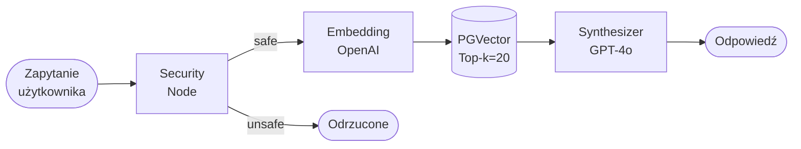

# Baseline Sequential RAG

## Opis

Najprostsza architektura RAG. Zapytanie użytkownika jest bezpośrednio wektoryzowane i przeszukiwane w bazie wektorowej. Zwrócone top-k fragmentów trafiają do modelu generatywnego bez żadnych kroków pośrednich.

Pełni rolę **punktu odniesienia (baseline)** — każda bardziej złożona architektura musi być lepsza od Baseline, żeby złożoność była uzasadniona.

## Pipeline

## Charakterystyka

| Cecha | Wartość |
|---|---|
| Kroki LLM | 1 (tylko synthesis) |
| Wywołania retrieval | 1 |
| Latency | najniższa |
| Koszt | najniższy |
| Obsługiwane typy pytań | proste faktyczne |

## Mocne strony

- Najszybsza i najtańsza architektura
- Zerowy narzut LLM przed retrievalem
- Dla prostych pytań faktycznych wynik porównywalny z bardziej złożonymi architekturami

## Słabe strony

- Całkowita zależność od jakości embeddingu zapytania
- Odpada gdy terminologia użytkownika różni się od dokumentu
- Nie radzi sobie z pytaniami wieloaspektowymi ani multi-hop
- Brak mechanizmu weryfikacji pokrycia kontekstu

## Kiedy Baseline wygrywa

Pytania **proste, jednoznaczne, terminologicznie spójne** z dokumentem:
> "Jaka jest cena abonamentu NovaCRM?"

## Kiedy Baseline odpada

Pytania wymagające syntezy lub wielokrotnego wyszukiwania:
> "Kto odpowiada za produkt z największym churnem?"

---

Powiązane: [[02-multi-query-rag]] | [[metodologia]] | [[pipeline]]
