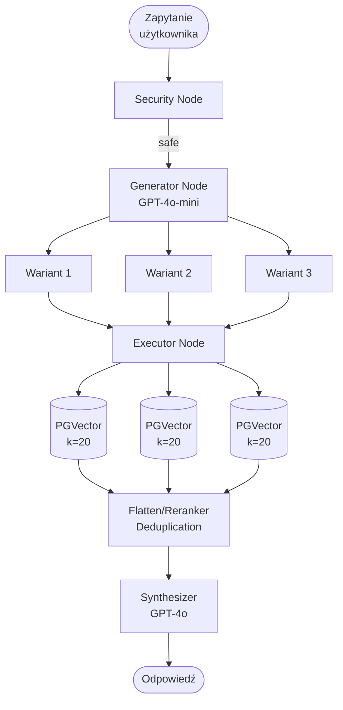
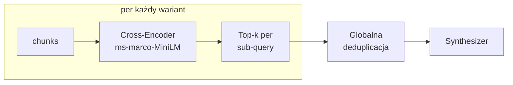

# Multi-Query RAG

## Opis

Model LLM automatycznie generuje **n wariantów reformulacji** oryginalnego zapytania. Każdy wariant jest niezależnie przeszukiwany w bazie wektorowej. Wyniki są deduplikowane i łączone przed etapem generowania.

Rozwiązuje kluczowy problem Baseline: **leksykalną przepaść** między zapytaniem użytkownika a treścią dokumentu.

## Pipeline

## Reranker (opcjonalny)

Gdy `RERANKING_ENABLED=true`: zamiast prostej deduplicacji, cross-encoder ocenia każdy chunk względem **swojego sub-query** i wybiera top-k per wariant.

## Charakterystyka

| Cecha | Wartość |
|---|---|
| Kroki LLM | 2 (generator + synthesis) |
| Wywołania retrieval | n (domyślnie 3) |
| Latency | średnia |
| Koszt | średni |
| Obsługiwane typy pytań | proste, terminologiczne, wieloaspektowe |

## Mocne strony

- Przełamuje barierę leksykalną (synonimia, parafrazy)
- Wyższy recall dzięki szerszemu przeszukaniu przestrzeni wektorowej
- Dobry stosunek jakości do kosztu
- Szczególnie skuteczny gdy użytkownik i dokument używają różnej terminologii

## Słabe strony

- n razy więcej wywołań retrieval → n × latency bazy
- Generator może produkować warianty zbyt podobne do siebie
- Nie radzi sobie z pytaniami wymagającymi sekwencyjnego rozumowania
- Deduplication może wyrzucić trafne chunki z niskim podobieństwem

## Kiedy Multi-Query wygrywa

Pytania gdzie **terminologia użytkownika ≠ terminologia dokumentu**:
> "Jak działa mechanizm skupienia uwagi?" → generuje: "attention mechanism", "self-attention", "scaled dot-product attention"

Pytania wieloaspektowe:
> "Jakie są funkcje i cena NovaCRM?" → 2 osobne wyszukiwania

## Kiedy Multi-Query odpada

Pytania wymagające połączenia informacji z różnych dokumentów:
> "Który team leader odpowiada za produkt z największym churnem?" — samo rozszerzenie zapytania nie pomaga, potrzeba sekwencji

---

Powiązane: [[01-baseline-rag]] | [[03-multi-step-rag]] | [[pipeline]]
