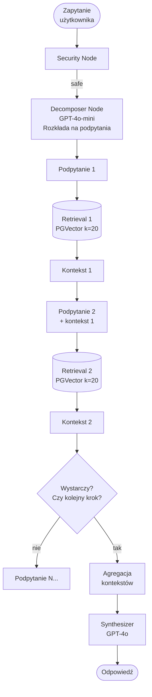

# Multi-Step RAG (dekompozycja zapytań)

## Opis

Złożone zapytanie jest automatycznie **rozkładane na podpytania** realizowane sekwencyjnie. Wynik poprzedniego kroku retrieval **informuje kolejny krok** — agent wie co już znalazł i czego mu brakuje. Zebrane fragmenty są agregowane w jeden kontekst końcowy.

Kluczowa różnica od Multi-Query: podpytania są **zależne od siebie** (kaskada), nie równoległe.

## Pipeline

## Charakterystyka

| Cecha | Wartość |
|---|---|
| Kroki LLM | 2+ (decomposer + synthesis) |
| Wywołania retrieval | sekwencyjne, zależne od dekompozycji |
| Latency | wysoka (sekwencja, nie równoległość) |
| Koszt | wyższy |
| Obsługiwane typy pytań | proste, terminologiczne, wieloaspektowe, **multi-hop**, **sekwencyjne** |

## Mocne strony

- Jedyna architektura (obok Agentic) zdolna do **multi-hop reasoning**
- Każdy krok retrieval jest kontekstowo poinformowany przez poprzedni
- Szczególnie skuteczna dla pytań gdzie odpowiedź z kroku A jest potrzebna do sformułowania kroku B

## Słabe strony

- Wyższa latency — kroki są sekwencyjne
- Błąd w pierwszym kroku kaskaduje do kolejnych
- Trudniejsza implementacja i debugowanie
- Nie opłaca się dla prostych pytań

## Kiedy Multi-Step wygrywa

Pytania **sekwencyjne/kaskadowe** — odpowiedź z dok. A potrzebna do szukania w dok. B:
> "Który product manager odpowiada za produkt z największym churnem w Q3?"
>
> Krok 1: "Który produkt miał największy churn w Q3?" → *NovaHR: 23%*
> Krok 2: "Kto jest PM produktu NovaHR?" → *Anna Kowalska*

Pytania porównawcze wymagające wielu źródeł:
> "Jak różni się architektura NovaCRM od NovaPay pod względem SLA?"

## Kiedy Multi-Step odpada

Pytania otwarte wymagające nieograniczonej liczby kroków — tu lepszy Agentic, który sam decyduje kiedy stop.

---

Powiązane: [[02-multi-query-rag]] | [[04-agentic-rag]] | [[pipeline]]
