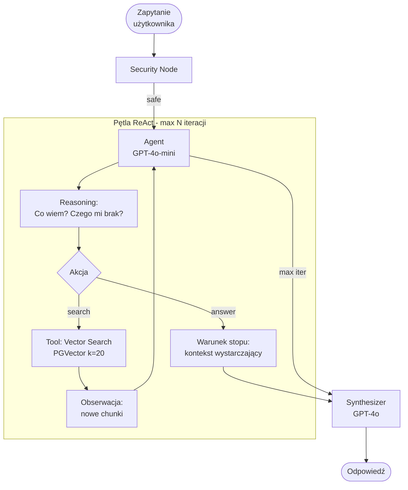

# Agentic RAG

## Opis

Autonomiczny agent LLM operuje w pętli rozumowania **ReAct (Reasoning + Acting)**. Agent samodzielnie planuje kolejne kroki retrieval, ocenia czy zebrany kontekst jest wystarczający do odpowiedzi i iteruje aż do osiągnięcia warunku stopu lub limitu iteracji.

Kluczowa różnica: agent **sam decyduje** ile retrieval-ów potrzebuje i jakie narzędzia użyć.

## Pipeline — pętla ReAct

## Narzędzia agenta

| Narzędzie | Opis |
|---|---|
| `vector_search(query, k)` | Przeszukuje PGVector, zwraca top-k chunków |
| `get_context_summary()` | Zwraca co agent zebrał do tej pory |

## Warunek stopu

Agent zatrzymuje się gdy:
1. Oceni że zebrany kontekst wystarczy do pełnej odpowiedzi (`answer` action)
2. Osiągnie limit iteracji (domyślnie: 5) — zabezpieczenie przed pętlą

## Charakterystyka

| Cecha | Wartość |
|---|---|
| Kroki LLM | N+1 (N iteracji agenta + synthesis) |
| Wywołania retrieval | dynamiczne, 1–N |
| Latency | najwyższa (nieprzewidywalna) |
| Koszt | najwyższy, zmienny |
| Obsługiwane typy pytań | wszystkie, w tym **synteza** i **eksploracja** |

## Mocne strony

- Dynamiczne dostosowanie liczby kroków do złożoności pytania
- Dla prostych pytań może skończyć w 1 iteracji (jak Baseline)
- Jedyna architektura zdolna do pełnej syntezy z wielu niezależnych źródeł
- Self-aware: wie kiedy nie ma wystarczającego kontekstu

## Słabe strony

- Nieprzewidywalna latency i koszt
- Ryzyko pętli lub nadmiarowego retrieval dla prostych pytań
- Trudny do debugowania (trace jest złożony)
- Halucynacje w rozumowaniu agenta mogą prowadzić do złych zapytań

## Kiedy Agentic wygrywa

Pytania **syntezy i eksploracji** — nie wiadomo z góry ile kroków potrzeba:
> "Opisz kondycję firmy TechNova na podstawie wszystkich dostępnych danych."
> "Jakie są systemowe przyczyny wysokiego churnu w produktach TechNova?"

## Kiedy Agentic odpada

Proste pytania faktyczne — overhead agenta nie jest uzasadniony, koszt i latency nieproporcjonalnie wysokie do zysku jakościowego.

---

Powiązane: [[03-multi-step-rag]] | [[metodologia]] | [[pipeline]]
