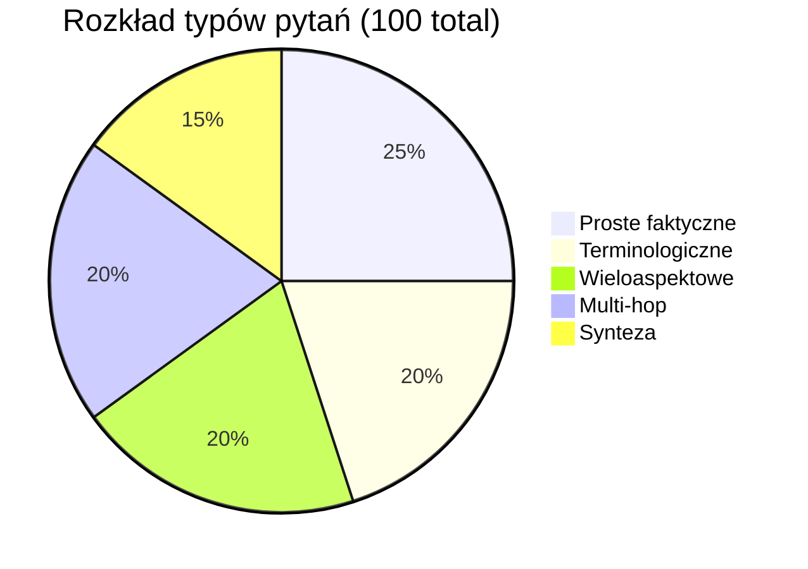

# Dataset ewaluacyjny

## Kolekcja: TechNova

Fikcyjna firma technologiczna SaaS B2B z Warszawy, skalująca się na rynki DACH. Jeden spójny zestaw dokumentów — wszystkie liczby i relacje są wewnętrznie konsekwentne.

### Dokumenty źródłowe

| Plik PDF | Zawartość | Strony |
|---|---|---|
| `raport_roczny_2023.pdf` | Przychody kwartalne, KPI, koszty, strategia | ~15 |
| `katalog_produktow.pdf` | 5 produktów: cena, funkcje, SLA, target | ~15 |
| `struktura_organizacyjna.pdf` | Działy, team leaderzy, headcount, zakresy | ~12 |
| `analiza_rynku.pdf` | Konkurenci, udziały rynkowe, trendy, segmenty | ~15 |
| `raport_satysfakcji.pdf` | NPS per produkt, churn, feedback, case studies | ~12 |
| `dokumentacja_techniczna.pdf` | Architektura systemu, stack, incydenty, roadmapa | ~15 |

### Produkty TechNova (spójne we wszystkich dokumentach)

| Produkt | Segment | Cena / mies. | NPS |
|---|---|---|---|
| NovaCRM | SMB | 299 PLN | 47 |
| NovaAnalytics | Mid-market | 899 PLN | 61 |
| NovaDocs | SMB | 149 PLN | 52 |
| NovaHR | Enterprise | 2 499 PLN | 38 |
| NovaPay | Enterprise | 3 299 PLN | 44 |

---

## Typologia pytań — 100 pytań



### Typ 1: Proste faktyczne (25 pytań)
Jeden fakt, jeden chunk, terminologia spójna z dokumentem.

**Cel:** ustalenie baseline — wszystkie architektury powinny dawać wynik ~3. Pozwala pokazać że złożoność nie jest zawsze potrzebna.

Przykład:
> "Jaka jest miesięczna cena abonamentu NovaCRM?"
> "Ile osób zatrudnia dział Customer Success?"

### Typ 2: Terminologiczne (20 pytań)
Ten sam fakt, ale pytanie używa innych słów niż dokument.

**Cel:** ujawnienie przewagi Multi-Query (reformulacja zapytania przełamuje barierę leksykalną).

Przykład:
> "Jakie są opłaty za korzystanie z systemu do zarządzania relacjami z klientami?" → dokument: "cena abonamentu NovaCRM"

### Typ 3: Wieloaspektowe (20 pytań)
Jedno pytanie, 2–3 wątki, jeden lub dwa dokumenty.

**Cel:** Multi-Query i Multi-Step powinny wygrywać z Baseline.

Przykład:
> "Jakie funkcje oferuje NovaHR i jakie jest jego SLA oraz cena?"
> "Opisz strategię ekspansji TechNova i jej głównych konkurentów."

### Typ 4: Multi-hop (20 pytań)
Odpowiedź wymaga połączenia informacji z 2 różnych dokumentów. Odpowiedź z kroku A jest kluczem do pytania B.

**Cel:** ujawnienie przewagi Multi-Step i Agentic. Baseline i Multi-Query powinny odpowiadać niepełnie lub błędnie.

Przykład:
> "Kto jest odpowiedzialny za produkt z najniższym NPS?" (raport satysfakcji → struktura org)
> "Jaki przychód wygenerował produkt z największym udziałem w rynku enterprise?" (analiza rynku → raport roczny)

### Typ 5: Synteza (15 pytań)
Wymagają agregacji informacji z 3+ miejsc/dokumentów.

**Cel:** scenariusz dla Agentic. Inne architektury mogą odpowiadać częściowo — to ważna obserwacja: za jaką cenę Agentic daje pełną odpowiedź?

Przykład:
> "Oceń pozycję konkurencyjną TechNova łącząc dane o rynku, satysfakcji klientów i wynikach finansowych."
> "Które produkty są zagrożone churnem i jakie są możliwe przyczyny techniczne?"

---

## Format ground truth

```json
{
  "id": "q042",
  "type": "multi_hop",
  "question": "Kto jest team leaderem odpowiedzialnym za produkt z najniższym NPS?",
  "relevant_chunk_ids": [
    "raport_satysfakcji_p004_c02",
    "struktura_organizacyjna_p007_c01"
  ],
  "expected_answer": "Anna Kowalska jest team leaderem produktu NovaHR, który osiągnął najniższy NPS wynoszący 38."
}
```

## Jak wypełnić ground truth

1. Wgraj PDFy przez importer Streamlit
2. W tabeli chunków znajdź relevantne fragment dla każdego pytania
3. Skopiuj `chunk_id` do `relevant_chunk_ids` w `questions.json`
4. Opcjonalnie uzupełnij `expected_answer`

---

Powiązane: [[metryki]] | [[metodologia]] | `eval/dataset/questions.json`
