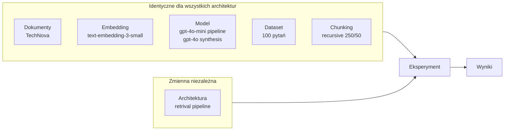
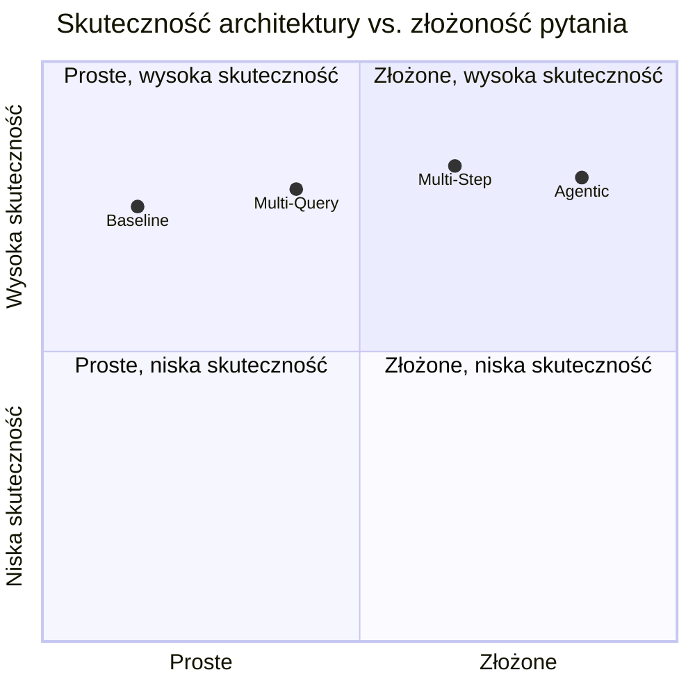

# Metodologia eksperymentu

## Cel badania

Porównanie czterech architektur RAG pod kątem jakości odpowiedzi, skuteczności retrieval i efektywności operacyjnej. Identyfikacja kiedy złożoność architekturalna jest uzasadniona, a kiedy prostsze rozwiązanie jest lepsze.

## Zasada izolacji zmiennej



Każda różnica w wynikach może być przypisana **wyłącznie architekturze** — wszystkie inne parametry są zablokowane.

## Architektura vs. typy pytań — oczekiwany rozkład wyników



## Dlaczego taki dobór pytań jest fair

Kluczowy argument metodologiczny: rozkład pytań **odzwierciedla realne wzorce użycia** systemu enterprise.

| Typ pytania | % w datasecie | Uzasadnienie |
|---|---|---|
| Proste faktyczne | 25% | Większość codziennych zapytań pracowników jest prosta |
| Terminologiczne | 20% | Różnica słownictwa użytkownik–dokument jest powszechna |
| Wieloaspektowe | 20% | Typowe zapytania "co wiem o X?" |
| Multi-hop | 20% | Pytania analityczne wymagające łączenia danych |
| Synteza | 15% | Rzadkie, ale wysokowartościowe zapytania strategiczne |

**Nie ma pytań zaprojektowanych tylko dla jednej architektury.** Każda architektura ma typy pytań gdzie powinna wygrywać i typy gdzie traci na koszcie/latency bez zysku jakościowego.

## Hipotezy badawcze

| Hipoteza | Co weryfikujemy |
|---|---|
| H1 | Baseline osiąga wyniki porównywalne do złożonych architektur dla pytań prostych faktycznych |
| H2 | Multi-Query znacząco poprawia Recall@k dla pytań terminologicznych |
| H3 | Multi-Step jest jedyną architekturą zdolną do poprawnego odpowiadania na pytania multi-hop |
| H4 | Agentic osiąga najwyższy Coverage dla pytań syntezy kosztem najwyższej latency i kosztu |
| H5 | Ceff (koszt per poprawna odpowiedź) dla Baseline jest najniższy dla pytań prostych |

## Protokół eksperymentu

```
Dla każdej architektury (4 architektury):
  Dla każdego pytania (100 pytań):
    Uruchom pipeline 5 razy (stability)
    Dla każdego uruchomienia:
      - zbierz context_metadata (chunk_ids)
      - zbierz answer
      - zmierz latency, tokeny, koszt
      - wywołaj LLM judge → quality(0-3), faithfulness(0/1)
    Oblicz stability (variance, consistency)
  Agreguj metryki per typ pytania
  Zapisz do eval/results/{arch}_{timestamp}.json
```

Łącznie: **4 × 100 × 5 = 2000 uruchomień pipeline** + **2000 wywołań judge**

## Ograniczenia badania

- LLM judge nie jest w 100% deterministyczny — dlatego `JUDGE_MODEL` to gpt-4o (większa spójność niż mini)
- Fikcyjny dataset — wyniki mogą nie generalizować na domeny z bardziej niestrukturyzowaną treścią
- Koszt eksperymentu zależy od temperatury modelu i długości kontekstu — obie zmienne zablokowane

---

Powiązane: [[metryki]] | [[dataset]] | [[01-baseline-rag]] | [[04-agentic-rag]]
