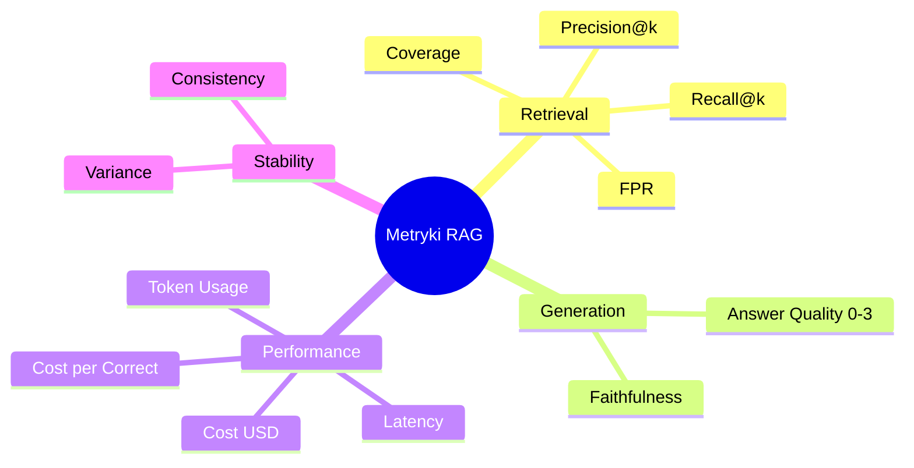

# Metryki ewaluacji

## Obszary pomiaru

---

## Retrieval

Porównanie chunków zwróconych przez system z ground truth (chunk_ids przypisanymi ręcznie do pytania).

### Recall@k
> Jaki % istotnych chunków system zdołał odnaleźć?

$$\text{Recall@k} = \frac{|\text{retrieved} \cap \text{ground truth}|}{|\text{ground truth}|}$$

Wysoki recall = system nie gubi ważnych informacji. **Kluczowa metryka dla RAG.**

### Precision@k
> Jaki % zwróconych chunków jest trafny?

$$\text{Precision@k} = \frac{|\text{retrieved} \cap \text{ground truth}|}{|\text{retrieved}|}$$

Niska precision = dużo szumu w kontekście przekazywanym do LLM.

### False Positive Rate (FPR)
> Jaki % zwróconych chunków jest irrelevantny?

$$\text{FPR} = \frac{|\text{retrieved} \setminus \text{ground truth}|}{|\text{retrieved}|}$$

FPR = 1 − Precision. Miara zaszumienia kontekstu.

### Coverage
> Czy system znalazł **wszystkie** potrzebne chunki?

$$\text{Coverage} = \begin{cases} 1 & \text{retrieved} \supseteq \text{ground truth} \\ 0 & \text{otherwise} \end{cases}$$

Binary. Szczególnie ważne dla pytań syntezy — brak jednego chunku może uniemożliwić pełną odpowiedź.

---

## Generation — LLM as Judge

Oceniający: **GPT-4o** (model `JUDGE_MODEL` w config).

Osobne wywołanie API — sędzia widzi: pytanie + retrieved context + odpowiedź systemu.

### Answer Quality

Skala 0–3:

| Score | Znaczenie |
|---|---|
| **0** | Niepoprawna — nie odpowiada lub zawiera błędy merytoryczne |
| **1** | Częściowo poprawna — ma dobre elementy, ale niepełna lub nieprecyzyjna |
| **2** | W większości poprawna — odpowiada na pytanie, ale pomija istotne info |
| **3** | W pełni poprawna — kompletna, precyzyjna, zgodna ze źródłami |

**Próg poprawności: ≥ 2** → używane do `is_correct` i `cost_per_correct_answer`.

### Faithfulness

| Score | Znaczenie |
|---|---|
| **0** | Hallucynacja — odpowiedź zawiera info spoza kontekstu |
| **1** | Ugruntowana — odpowiedź wynika wyłącznie z retrieved chunks |

---

## Performance

### Latency
Czas od otrzymania zapytania do zwrócenia odpowiedzi (ms). Mierzone przez `time.perf_counter()` w runnerze.

### Token Usage
Tokeny input + output per wywołanie LLM. Zbierane przez `MetricsCollector` (LangChain callback).

### Cost USD
$$\text{cost} = \text{tokens\_in} \times \text{price\_in} + \text{tokens\_out} \times \text{price\_out}$$

Cennik (maj 2025):
| Model | Input / 1M | Output / 1M |
|---|---|---|
| gpt-4o | $2.50 | $10.00 |
| gpt-4o-mini | $0.15 | $0.60 |

### Cost per Correct Answer (Ceff)

$$C_{eff} = \frac{\text{total cost}}{\text{liczba poprawnych odpowiedzi}}$$

Efektywność kosztowa — bezpośrednie powiązanie jakości z kosztem.

---

## Stability (N=5 runs per pytanie)

### Variance
$$\text{Var} = \frac{1}{N}\sum_{i=1}^{N}(q_i - \bar{q})^2$$

gdzie $q_i$ = answer_quality w i-tym uruchomieniu. Wysoka wariancja = niestabilny model.

### Consistency
$$\text{Consistency} = \frac{\text{liczba runs z modalną oceną}}{N}$$

% uruchomień które dały ten sam wynik co dominanta. 1.0 = zawsze ten sam wynik.

---

Powiązane: [[dataset]] | [[metodologia]] | `eval/metrics/`
