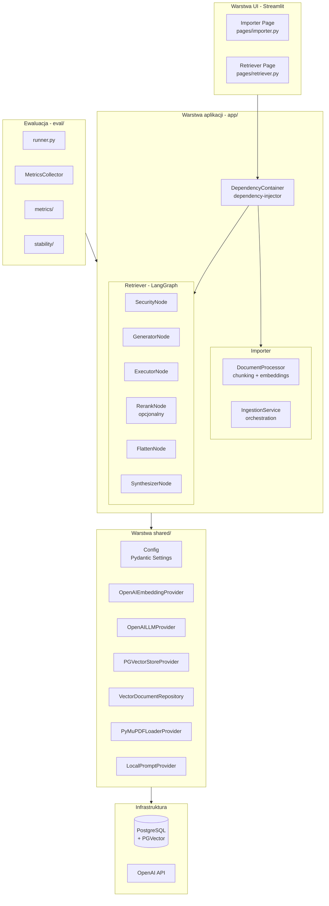

# Architektura systemu

## Warstwy

## Kluczowe decyzje projektowe

| Decyzja | Uzasadnienie |
|---|---|
| Dependency Injection (`dependency-injector`) | Łatwa podmiana komponentów per architektura |
| LangGraph dla pipeline | Wizualny graf, łatwe dodawanie węzłów |
| Repository Pattern | Odizolowanie logiki retrieval od vector store |
| Strategy Pattern (chunking) | `recursive` / `semantic` przełączane przez env var |
| Lazy import `sentence-transformers` | Działa bez torch (Python 3.13 lokalnie) |

## Konfiguracja (env vars)

| Zmienna | Domyślnie | Opis |
|---|---|---|
| `OPENAI_API_KEY` | wymagany | — |
| `RERANKING_ENABLED` | `true` | Włącza RerankNode w grafie |
| `CHUNKING_STRATEGY` | `recursive` | `recursive` lub `semantic` |
| `CHUNK_SIZE` | `250` | Rozmiar chunku w znakach |
| `CHUNK_OVERLAP` | `50` | Nakładanie się chunków |
| `COLLECTION_NAME` | `study_docs` | Kolekcja PGVector |
| `JUDGE_MODEL` | `gpt-4o` | Model do ewaluacji |
| `DB_HOST` | `db` | Host PostgreSQL |

---

Powiązane: [[pipeline]] | [[01-baseline-rag]]
