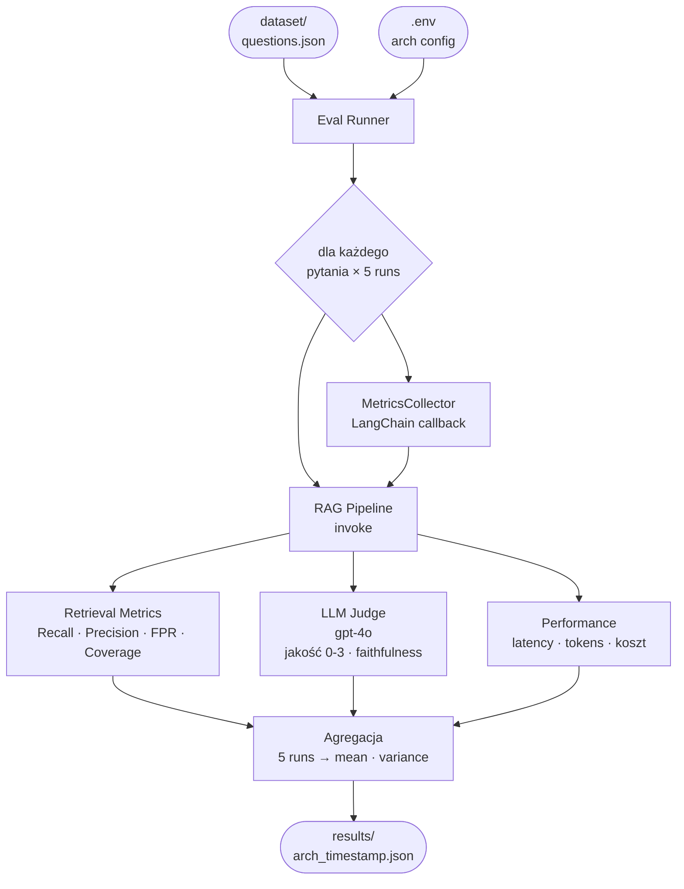

# Evaluator Pipeline

## Opis

Moduł ewaluacyjny uruchamia każde pytanie z datasetu przez pipeline RAG, zbiera metryki retrieval, jakości odpowiedzi, wydajności i stabilności. Wyniki zapisuje do JSON.

## Pipeline



## Metryki

### Retrieval (vs ground truth chunk_ids)

| Metryka | Opis |
|---------|------|
| `recall@k` | % trafnych chunków odnalezionych (k=10, 20) |
| `precision@k` | % zwróconych chunków które są trafne |
| `fpr` | % chunków nieistotnych wśród zwróconych |
| `coverage` | 1 jeśli wszystkie ground truth chunki odnalezione, 0 jeśli nie |

### Generation (LLM judge gpt-4o)

| Metryka | Skala | Opis |
|---------|-------|------|
| `answer_quality` | 0–3 | 0=błędna, 1=częściowa, 2=w większości OK, 3=pełna |
| `faithfulness` | 0/1 | czy odpowiedź wynika z chunków (bez halucynacji) |

Odpowiedzi z `answer_quality ≥ 2` uznawane za poprawne.

### Performance

| Metryka | Opis |
|---------|------|
| `latency_ms` | czas całego pipeline |
| `tokens_in` | tokeny wejściowe (wszystkie wywołania LLM) |
| `tokens_out` | tokeny wyjściowe |
| `cost_usd` | koszt według cennika OpenAI |
| `cost_per_correct` | koszt / liczba poprawnych odpowiedzi |

### Stability (5 runs per pytanie)

| Metryka | Opis |
|---------|------|
| `quality_variance` | wariancja `answer_quality` między runami |
| `consistency` | % runów z identycznym wynikiem (≥2 lub <2) |

## Format wyniku

```json
{
  "run_id": "multiquery_20240115_143022",
  "architecture": "multi_query",
  "config": { "chunk_size": 250, "k": 20, "reranking": false },
  "summary": {
    "recall_at_10_mean": 0.82,
    "precision_at_10_mean": 0.31,
    "answer_quality_mean": 2.4,
    "faithfulness_rate": 0.91,
    "latency_ms_mean": 1823,
    "cost_usd_total": 4.32,
    "cost_per_correct": 0.067
  },
  "questions": [ ]
}
```

## Struktura katalogów

```
eval/
├── dataset/
│   └── questions.json
├── metrics/
│   ├── retrieval.py
│   ├── generation.py
│   └── performance.py
├── stability/
│   └── analyzer.py
├── collector.py
├── runner.py
└── results/
    └── {arch}_{timestamp}.json
```
