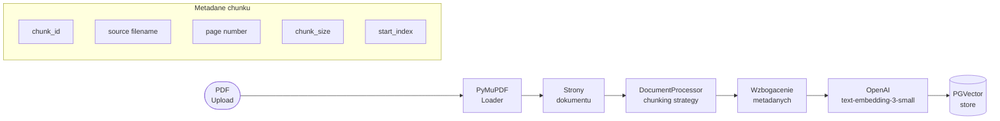

# Importer Pipeline

## Opis

Moduł odpowiedzialny za ingestion dokumentów PDF do systemu. Przetwarza plik PDF na chunki, generuje embeddingi i zapisuje do PGVector. Każdy chunk otrzymuje unikalny identyfikator używany w ewaluacji.

## Pipeline



## Strategie chunkowania

| Strategia | Config | Opis |
|-----------|--------|------|
| `recursive` | domyślna | RecursiveCharacterTextSplitter, chunk_size=250, overlap=50 |
| `semantic` | `CHUNKING_STRATEGY=semantic` | SemanticChunker — granice semantyczne |

## Format chunk_id

```
{nazwa_pliku_bez_ext}_p{numer_strony:03d}_c{indeks_lokalny:02d}

Przykład: attention_paper_p003_c01
```

## Parametry konfiguracyjne

| Zmienna | Domyślnie | Opis |
|---------|-----------|------|
| `CHUNK_SIZE` | 250 | Rozmiar chunku w znakach |
| `CHUNK_OVERLAP` | 50 | Nakładanie chunków |
| `CHUNKING_STRATEGY` | recursive | Strategia podziału |
| `COLLECTION_NAME` | study_docs | Kolekcja w PGVector |
